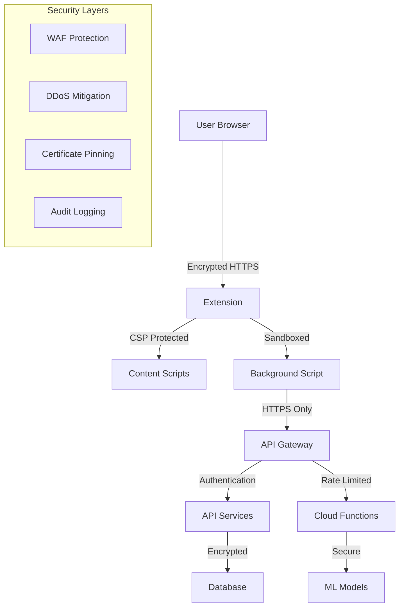

# 🔒 Security Policy

## Supported Versions

We actively maintain and provide security updates for the following versions:

| Version | Supported          | Notes                |
| ------- | ------------------ | -------------------- |
| 3.0.x   | ✅ Yes             | Current stable       |
| 2.0.x   | ❌ No              | Legacy (deprecated)  |
| 1.0.x   | ❌ No              | Legacy (deprecated)  |

## Security Features

### 🛡️ Built-in Security Measures

**Browser Extension Security:**
- ✅ **Manifest V3** - Latest Chrome extension security model
- ✅ **Minimal Permissions** - Only necessary APIs requested
- ✅ **Content Security Policy (CSP)** - Strict script execution controls
- ✅ **Sandboxed Execution** - Isolated content script environment
- ✅ **No Remote Code Execution** - All code bundled and verified

**Data Protection:**
- ✅ **Local-First Processing** - Core scanning happens client-side
- ✅ **No Raw Media Storage** - Only metadata and hashes processed
- ✅ **Opt-in Telemetry** - User explicitly consents to data sharing
- ✅ **GDPR Compliance** - Right to deletion and data portability
- ✅ **Encrypted Communications** - All API calls use HTTPS/TLS 1.3

**Input Validation:**
- ✅ **URL Sanitization** - All URLs validated before processing
- ✅ **File Type Validation** - Strict media type checking
- ✅ **Size Limits** - Maximum file sizes enforced
- ✅ **Timeout Protection** - All operations have timeouts
- ✅ **Error Boundaries** - Graceful failure handling

## Reporting a Vulnerability

### 🚨 Security Contact

**For security issues, please DO NOT use public GitHub issues.**

Instead, report security vulnerabilities through our secure channels:

**Primary Contact:**
- 📧 **Email**: security@monarch-tech.dev
- 🔐 **PGP Key**: [Download Public Key](https://monarch-tech.dev/.well-known/pgp-key.asc)
- 🕒 **Response Time**: Within 24 hours

**Alternative Contact:**
- 📧 **Email**: security@soft-armor.io
- 💬 **Signal**: Available upon request
- 📱 **WhatsApp**: Available upon request

### 📋 Vulnerability Report Template

Please include the following information in your security report:

```markdown
**Vulnerability Type:** [e.g., XSS, CSRF, Data Exposure, etc.]
**Severity Level:** [Critical/High/Medium/Low]
**Affected Component:** [Extension/API/Website/etc.]
**Attack Vector:** [Description of how to exploit]
**Impact:** [What data/functionality is at risk]
**Steps to Reproduce:** [Detailed reproduction steps]
**Proof of Concept:** [Code/screenshots if applicable]
**Suggested Fix:** [If you have recommendations]
**Discovery Credit:** [How you'd like to be credited]
```

### 🎯 Scope

**In Scope:**
- ✅ Soft-Armor browser extension (all versions)
- ✅ API endpoints (api.soft-armor.io)
- ✅ Website and documentation (soft-armor.io)
- ✅ Authentication and billing systems
- ✅ Data processing and storage
- ✅ Third-party integrations

**Out of Scope:**
- ❌ General browser vulnerabilities
- ❌ Operating system issues
- ❌ Third-party websites using our extension
- ❌ Social engineering attacks
- ❌ Physical access attacks
- ❌ DoS attacks against our infrastructure

### 💰 Bug Bounty Program

We operate a **responsible disclosure program** with recognition and rewards:

**Reward Levels:**
- 🔴 **Critical** (RCE, Data Breach): €1,000 - €5,000
- 🟠 **High** (Privilege Escalation, XSS): €500 - €1,500  
- 🟡 **Medium** (CSRF, Info Disclosure): €100 - €500
- 🟢 **Low** (Rate Limiting, Minor Issues): €50 - €150

**Recognition:**
- 🏆 **Hall of Fame** listing on our security page
- 🎁 **Soft-Armor swag** and merchandise
- 📜 **Official acknowledgment** in release notes
- 🤝 **LinkedIn recommendation** for security researchers

## Response Process

### ⏱️ Response Timeline

| Phase | Timeline | Actions |
|-------|----------|---------|
| **Initial Response** | Within 24 hours | Acknowledge receipt, assign tracking ID |
| **Assessment** | Within 72 hours | Severity evaluation, impact assessment |
| **Validation** | Within 1 week | Reproduce issue, confirm vulnerability |
| **Fix Development** | 1-4 weeks | Develop and test security patch |
| **Release** | Within 30 days | Deploy fix, notify reporter |
| **Disclosure** | 90 days max | Coordinate public disclosure |

### 🔧 Remediation Process

1. **Immediate Response** (Critical/High)
   - Incident response team activated
   - Temporary mitigations deployed if needed
   - Affected users notified if required

2. **Fix Development**
   - Security patch developed and tested
   - Code review by security team
   - Automated testing in staging environment

3. **Deployment**
   - Emergency release for critical issues
   - Standard release cycle for lower severity
   - Monitoring for successful deployment

4. **Verification**
   - Confirm fix resolves the issue
   - No regression testing
   - Security researcher verification

### 📢 Public Disclosure

**Coordinated Disclosure:**
- We follow a **90-day disclosure timeline**
- Security advisories published on GitHub
- CVE assignments for qualifying vulnerabilities
- Blog post for significant security improvements

**Communication Channels:**
- 📧 Email notifications to registered users
- 📱 In-app security notifications (if applicable)
- 🐦 Twitter announcements (@SoftArmorSec)
- 📰 Blog posts on soft-armor.io/security

## Security Best Practices

### 🔐 For Users

**Installation Security:**
- ✅ Only install from official Chrome Web Store
- ✅ Verify extension publisher: "Monarch AS"
- ✅ Check permissions before installation
- ✅ Keep extension updated automatically
- ❌ Don't install from unknown sources

**Usage Security:**
- ✅ Review scan results before trusting
- ✅ Use Pro features for high-stakes verification
- ✅ Report suspicious behavior immediately
- ✅ Understand extension limitations
- ❌ Don't rely solely on automated scanning

### 👩‍💻 For Developers

**Development Security:**
- ✅ Follow secure coding guidelines
- ✅ Use TypeScript for type safety
- ✅ Implement comprehensive input validation
- ✅ Regular dependency security audits
- ✅ Code review for all changes

**API Security:**
- ✅ Authentication required for all endpoints
- ✅ Rate limiting implemented
- ✅ Input sanitization and validation
- ✅ Comprehensive logging and monitoring
- ✅ Regular penetration testing

### 🏢 For Organizations

**Deployment Security:**
- ✅ Test in staging environment first
- ✅ Monitor extension usage and alerts
- ✅ Regular security awareness training
- ✅ Incident response procedures
- ✅ Data classification and handling policies

## Security Audits

### 🔍 Internal Audits

**Regular Security Reviews:**
- 📅 **Monthly**: Dependency vulnerability scans
- 📅 **Quarterly**: Code security reviews
- 📅 **Annually**: Comprehensive penetration testing
- 📅 **On-demand**: Pre-release security testing

**Automated Security Tools:**
- 🔧 **Dependabot**: Dependency vulnerability alerts
- 🔧 **CodeQL**: Static application security testing
- 🔧 **ESLint Security**: JavaScript security linting
- 🔧 **Snyk**: Container and dependency scanning

### 🏆 External Audits

**Third-Party Security Assessments:**
- 🗓️ **Q1 2025**: Planned comprehensive security audit
- 🗓️ **Q3 2025**: Penetration testing by external firm
- 🗓️ **Annual**: SOC 2 Type II compliance review

**Bug Bounty Platforms:**
- 🌐 **HackerOne**: Public bug bounty program
- 🌐 **Bugcrowd**: Supplementary testing program
- 🌐 **University Programs**: Academic security research

## Security Architecture

### 🏗️ System Security Design



**Security Boundaries:**
- 🔲 **Browser Sandbox**: Extension runs in isolated environment
- 🔲 **Network Security**: TLS 1.3 for all communications
- 🔲 **API Security**: OAuth 2.0 + JWT authentication
- 🔲 **Data Security**: Encryption at rest and in transit
- 🔲 **Infrastructure Security**: Cloud provider security controls

### 🔒 Data Security

**Data Classification:**
- 🟢 **Public**: Marketing materials, documentation
- 🟡 **Internal**: Usage statistics, aggregated metrics
- 🟠 **Confidential**: User preferences, scan history
- 🔴 **Restricted**: API keys, user credentials

**Data Protection Measures:**
- 🔐 **Encryption**: AES-256 for data at rest
- 🔐 **Transport**: TLS 1.3 for data in transit
- 🔐 **Access Control**: Role-based permissions
- 🔐 **Data Retention**: Automated deletion policies
- 🔐 **Backup Security**: Encrypted backup storage

## Compliance & Standards

### 📋 Regulatory Compliance

**Privacy Regulations:**
- ✅ **GDPR** (General Data Protection Regulation)
- ✅ **CCPA** (California Consumer Privacy Act)
- ✅ **PIPEDA** (Personal Information Protection and Electronic Documents Act)

**Security Standards:**
- ✅ **OWASP Top 10** - Web application security
- ✅ **NIST Cybersecurity Framework** - Risk management
- ✅ **ISO 27001** - Information security management

### 🏅 Security Certifications

**Current Certifications:**
- 🏆 **SOC 2 Type I** (In Progress)
- 🏆 **Privacy Shield** (Self-Certification)

**Planned Certifications:**
- 📅 **SOC 2 Type II** (Q2 2025)
- 📅 **ISO 27001** (Q4 2025)

## Contact Information

### 🚨 Emergency Security Contact

**For urgent security issues requiring immediate attention:**
- 📞 **Phone**: +47 XXX XXX XXX (24/7 security hotline)
- 📧 **Email**: security-emergency@monarch-tech.dev
- 💬 **Signal**: [Signal contact available upon request]

**Security Team:**
- 👤 **CISO**: security-officer@monarch-tech.dev
- 👤 **Security Lead**: security-lead@monarch-tech.dev
- 👤 **Incident Response**: incident-response@monarch-tech.dev

### 📬 General Security Information

- 🌐 **Security Page**: https://soft-armor.io/security
- 📄 **Security Blog**: https://blog.soft-armor.io/category/security
- 🔔 **Security Advisories**: https://github.com/Monarch-Tech-Dev/soft-armor/security/advisories
- 📱 **Security Updates**: Follow @SoftArmorSec on Twitter

---

## Version History

| Version | Date | Changes |
|---------|------|---------|
| 1.0.0 | 2024-12-XX | Initial security policy |
| 1.1.0 | 2025-01-XX | Added bug bounty program |

---

**Last Updated**: December 2024  
**Next Review**: March 2025

*This security policy is reviewed and updated quarterly to ensure it reflects current best practices and emerging threats.*